# Getting Started

Business Execution Graph is a tool that visualize inter-process interactions from a process-enriched object-centric event log (OCEL). It offers a clean interface and intuitive design, allowing users to get started quickly and efficiently.

To begin, follow the steps below.

## Installation and Set Up
### Prerequisties
- [Node.js](https://nodejs.org/) >= 16.x
- [Python](https://www.python.org/) >= 3.8
- [pip](https://pip.pypa.io/en/stable/)

### 1. Clone the Repository
```bash
git clone https://github.com/hudsonjychen/business-execution-graph.git
cd business-execution-graph
```

### 2. Set Up the Backend
#### Windows
```bash
cd backend
python -m venv venv
venv\Scripts\activate
pip install -r requirements.txt
python run.py
```
#### macOS
```bash
cd backend
python -m venv venv
source venv/bin/activate
pip install -r requirements.txt
python run.py
```

### 3. Set Up the Frontend
```bash
cd frontend
npm install
npm run dev
```

## Import a File

To get started, click the **Import** button at the top-right corner of the interface and upload a process enriched OCEL file exported from **Procellar**.

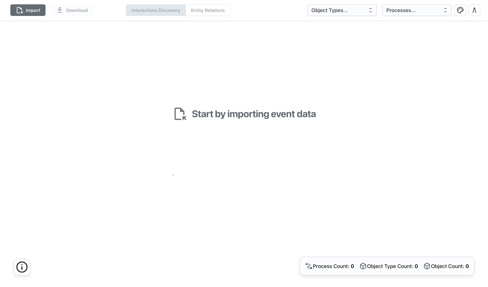

Make sure the file has been processed with process embeb to ensure successful import and visualization.

To try out the tool, you can also use the sample data provided in the [example-data](../example-data/). This example data is based on [ContainerLogistics](https://ocel-standard.org/event-logs/simulations/logistics/) and has been processed by Procellar. It is the same data used in our [case study](https://github.com/shahrzadkhayatbashi/Process-Level-OCPM).

Once the file is successfully imported and loaded, you can hover over the **Information** button at the bottom-left corner of the page to view details about the file, including its name, size, and upload time.

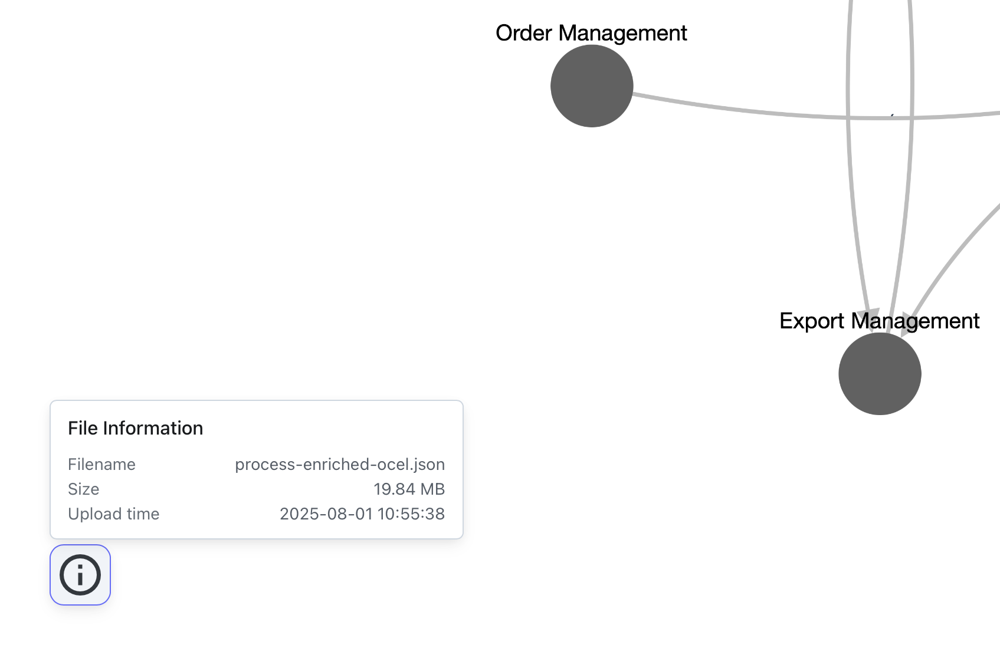

You will also find a **summary bar** at the bottom-right corner of the page showing the processes contained in the file, as well as the associated object types and object counts.

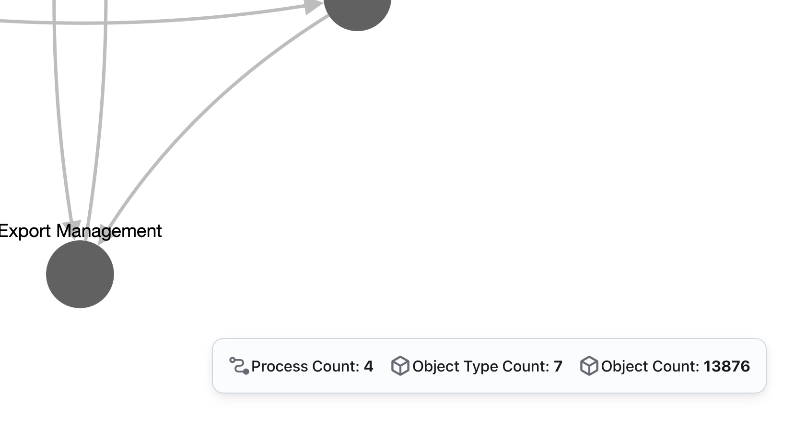

## Interactions Discovery View

By default, the center area of the **main area (canvas)** displays the discovered inter-process interactions — this is the **Interactions Discovery** view. You can confirm this via the **switcher** in the center of the header, where *Interactions Discovery* is selected.

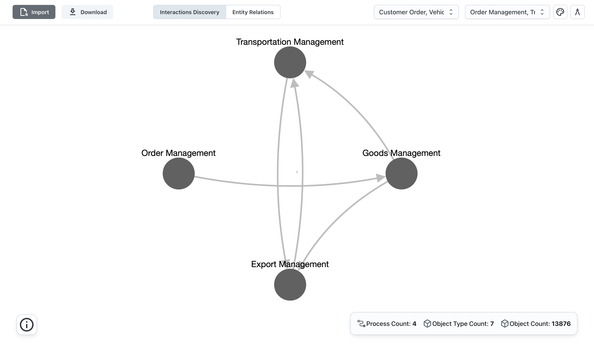

Each node in the canvas represents a **process**. A directed edge between two nodes indicates a dependency, specifically shared objects between the two processes. The direction of the edge shows the flow of objects from one process to another. This interaction graph provides an intuitive view of process relationships.

### Exploring the Interaction Graph
The **Business Execution Graph** offers rich interactions and options to help you explore inter-process interactions:

**Zoom in/out** and **drag nodes** to freely explore the graph layout.
Use the **filters** in the top-right corner to filter by object types and processes, allowing you to customize the view for analysis.

Let’s take an example. Suppose you’re not interested in the `Export Management` process. You can deselect it from the **process filter**, and the interaction graph will update accordingly. The `Export Management` node and its connected edges will be removed, making the relationships among the remaining three processes simpler.

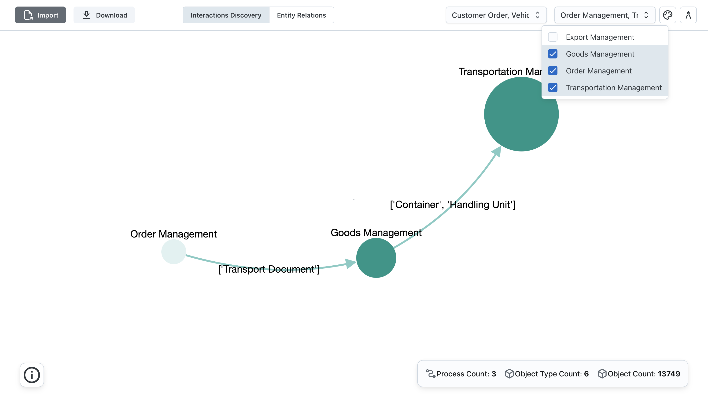

The same applies to the **object type filter**. When you deselect one or more object types, the process nodes or edges not related to any selected object types will be removed.

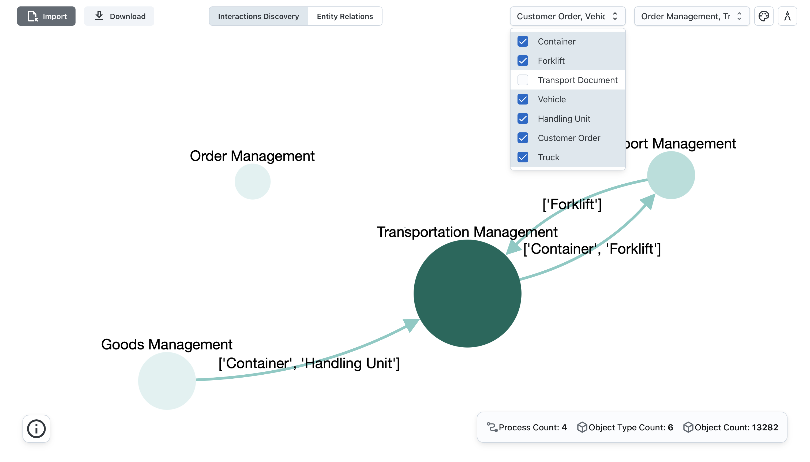

Additional tools in the top-right corner include the **color palette** and **graph configuration** (compass icon) buttons, which provide advanced customization options.

### Color Palette

Click the **color palette** icon to open the menu.

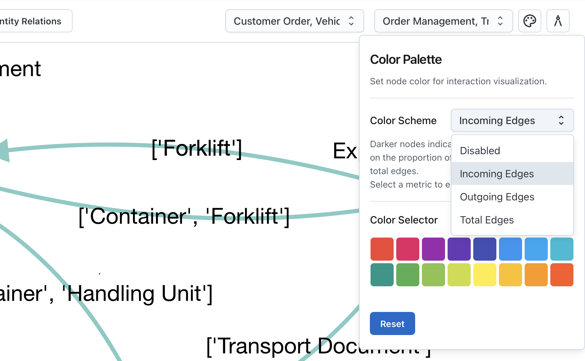

Here, you can choose a **color scheme**, which determines node color darkness based on a selected metric:

- `Incoming Edges`: Number of incoming edges.
- `Outgoing Edges`: Number of outgoing edges.
- `Total Edges`: Total number of edges.

Darker colors indicate higher values for the selected metric.

Below, you can choose a base color from the **color picker** (default is gray).

Click Reset to restore default color settings.

### Graph Configurations

Click the compass icon to open the menu.

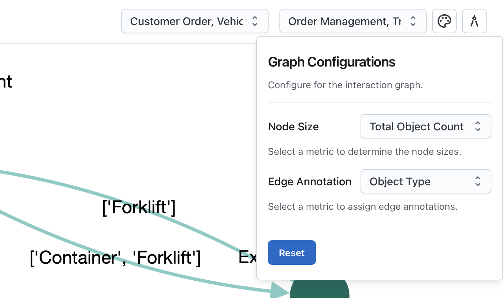

**Node Size** options:
- `Total Object Count`: Total number of objects associated with each process.
- `Object Type Diversity`: Number of distinct object types associated with each process.

Larger nodes represent higher values of the selected metric.

**Edge Annotation** options:
- `Total Object Count`: Number of objects flowing from one process to another.
- `Object Types`: List of types of objects flowing from one process to another.
- `Average Flow Time`: Average time objects take to flow from one process to another.

After the settings and configurations, the interaction graph now looks more informative!

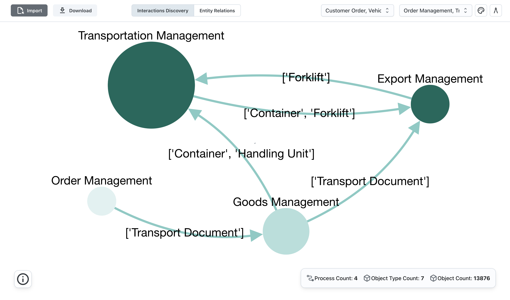


## Entity Relations View

Switch to the **Entity Relations view** using the switcher in the center of the header.

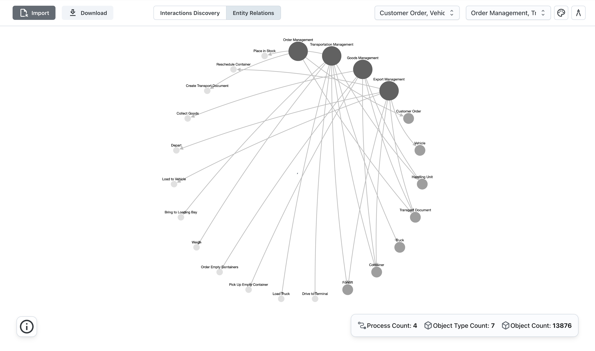

This view shows relationships between entities: large to small nodes represent **Processes**, **Object Types**, and **Activities (Event Types)**.

Object types and activities are connected to their related processes.

You can also **zoom**, **drag nodes**, and use **filters** — identical to those in the **Interactions Discovery view** — to customize the display.

The **color palette** and **graph configuration** menus are available in the top-right corner, with different options tailored to this view.

### Color Palette
Use the menu to assign different colors to each node type (**Process**, **Object Type**, and **Activity**) to help visually distinguish them.

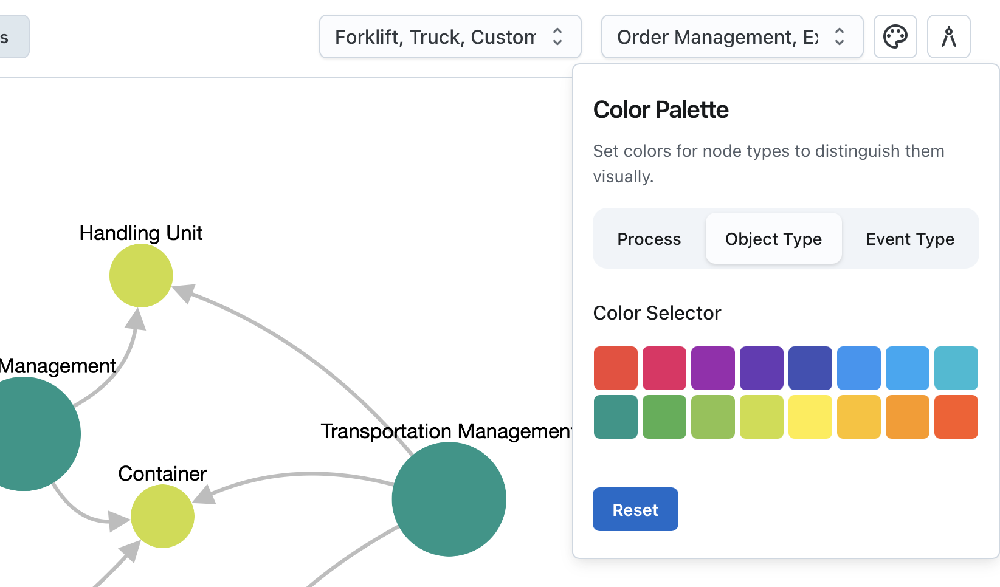

Click **Reset** to restore default color settings.

### Graph Configurations
In the menu, you can:

- `Showing Node Types`: Choose to display both Object Types and Activities, or only one of them (e.g., only Object Types).
- `Node Share Status`: Filter nodes based on whether they are shared (related to multiple processes) or non-shared (related to only one process). Options include: `Both`, `Shared`, and `Non-shared`.

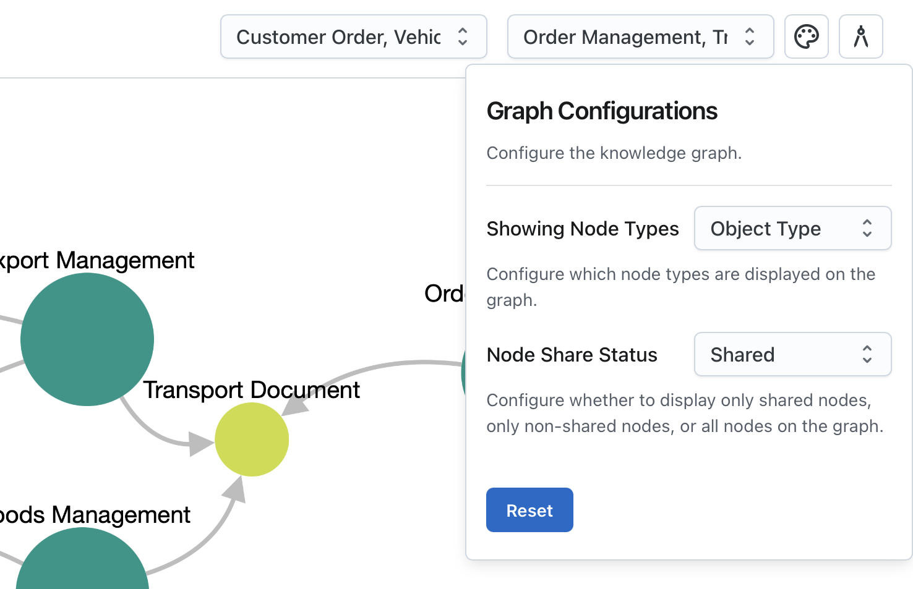

## Export
Business Execution Graph supports to export the graph as `PNG` or a `json` file that applies the **VOSViewer**.

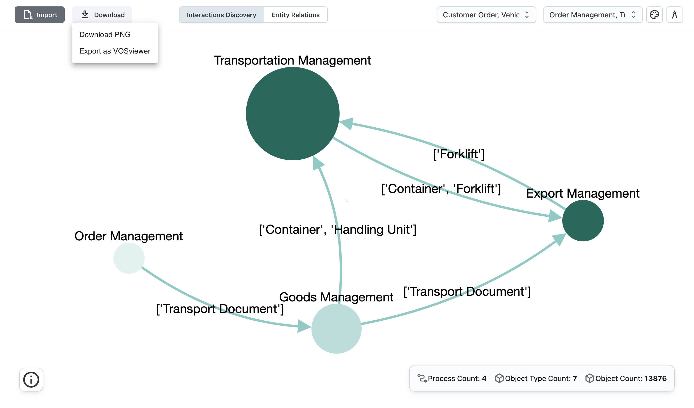

Click **Export** button at the top-right corner to export.